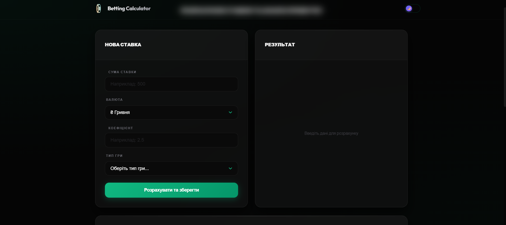
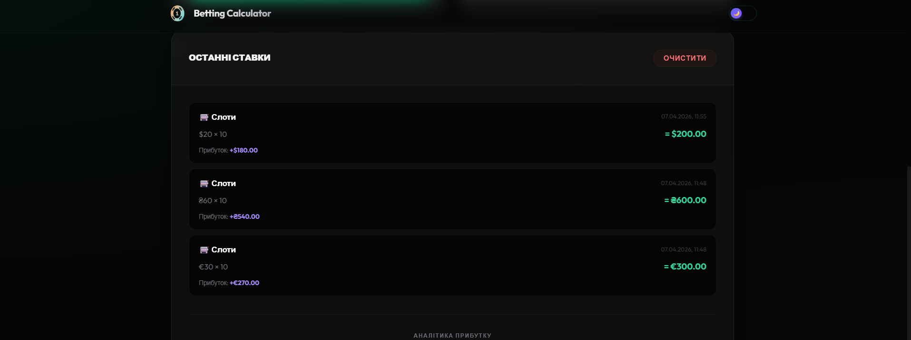
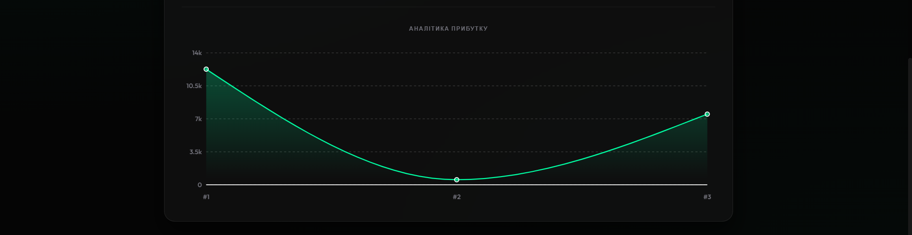

# 🎰 Betting Calculator

Інтерактивний React-додаток для розрахунку параметрів ставок із візуалізацією прибутку, підтримкою мультивалютності та темної теми. Проєкт виконано в рамках навчального завдання з упором на чисту архітектуру та надійність коду.


### 📸 Галерея проєкту

| Форма введення | Аналітика прибутку | Історія та тренд |
| :---: | :---: | :---: |
|  |  |  |

## 🚀 Технологічний стек

- **Core:** React 18 (Functional Components, Hooks)
- **Build Tool:** Vite
- **Language:** TypeScript (повна типізація)
- **State Management:** Custom Hook (`useBetCalculator`), LocalStorage
- **Styling:** CSS Modules (Premium Glassmorphism Design)
- **Visualization:** Recharts (Profit Trend Area Chart)
- **Testing:** Vitest + React Testing Library

## ✨ Основні можливості

- **Real-time розрахунок:** Миттєве оновлення виграшу та прибутку при введенні даних.
- **Повна валідація:** Суворі перевірки на суму (max 100k) та коефіцієнт (max 1000) з виведенням помилок.
- **Історія ставок:** Зберігання останніх 5 записів у `localStorage` (FIFO).
- **Мультивалютність:** Підтримка UAH, USD, EUR з автоматичною нормалізацією для графіку.
- **Адаптивний дизайн:** Коректне відображення від 320px до 1440px.
- **Темна/Світла теми:** Автоматичне перемикання та збереження вибору.
- **Графік прибутку:** Візуалізація успішності останніх ставок з урахуванням валютних курсів.

## 🧪 Тестування

Проєкт покритий Unit-тестами для перевірки бізнес-логіки:
- Валідація форм (граничні значення, некоректні типи даних).
- Форматування даних для графіку та логіка кольорів.
- Нормалізація валют.

Запуск тестів:
```bash
npm run test
```

## 📦 Встановлення та запуск

1. Клонуйте репозиторій:
```bash
git clone https://github.com/YOUR_USERNAME/betting-calculator.git
```

2. Встановіть залежності:
```bash
npm install
```

3. Запустіть сервер для розробки:
```bash
npm run dev
```

4. Збірка проєкту:
```bash
npm run build
```

## 🏗️ Архітектура

Проєкт побудований за принципом розділення логіки та відображення:
- `src/components`: UI-компоненти (Dumb components).
- `src/hooks`: Бізнес-логіка та керування станом (`useBetCalculator`).
- `src/utils`: Чисті функції для математичних розрахунків та валідації.
- `src/constants`: Статичні дані (типи ігор, валюти).

---

## 🏆 Виконані бонуси (12/12)
- [x] **Custom Hook** — вся логіка у `useBetCalculator()`.
- [x] **Dark / Light Mode** — перемикач теми з підтримкою контексту.
- [x] **📊 Графік прибутку** — інтеграція Recharts.
- [x] **💱 Мультивалютність** — конвертація UAH / USD / EUR.
- [x] **🧪 Тести** — Vitest для валідації та розрахунків.
- [x] **🧩 TypeScript** — повна типізація всього проєкту.

📅 **Дата здачі:** 07 квітня 2026
